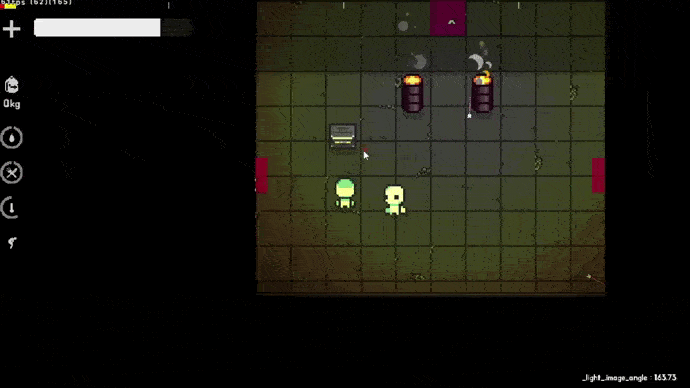
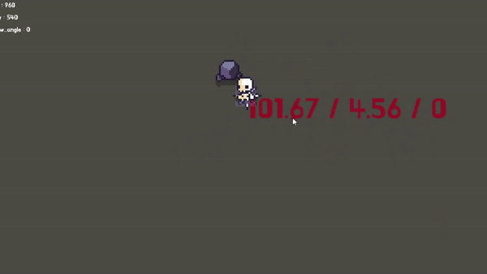

# Distress_diary_multiplayer

멀티 플레이 게임

대충 파밍하면서 아이템 가지고 노는 생존 RPG게임으로 제작중이였음

도트찍는데 그림을 못그려서 그런지 한계가 느껴져서 현재는 개발 중단 상태. 
나중에 개발할 예정

대충 크게 중요한 코드 내용들은 아래 참고
- 멀티플레이 시스템 (P2P방식)

- 랜덤맵 (아이작식 랜덤맵 같은데, 그거랑 무관하게 직접 만든 알고리즘)

- 멀티셀 알고리즘 (타르코프식 인벤토리 시스템, 아이템 가로 세로 회전도 가능)

- 철퇴 (플레이어가 열심히 흔들면 철퇴에 가속도 붙는 방식)

등등...
